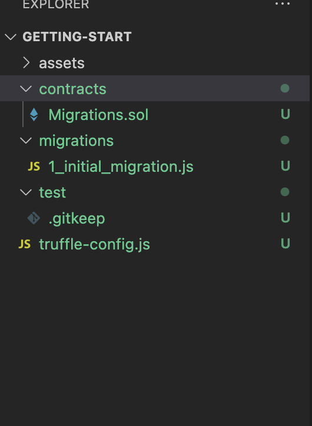

# Getting Started in Smart Contract Development with Solidity
## [Solidity](https://docs.soliditylang.org/)
Solidity is an object-oriented, high-level language for implementing smart contracts. Smart contracts are programs which govern the behaviour of accounts within the Ethereum state.
Solidity is a [curly-bracket language](https://en.wikipedia.org/wiki/List_of_programming_languages_by_type#Curly-bracket_languages). It is influenced by C++, Python and JavaScript, and is designed to target the Ethereum Virtual Machine (EVM).

## [Web3](https://web3js.readthedocs.io/en/v1.2.11/index.html)
web3.js is a collection of libraries that allow you to interact with a local or remote ethereum node using HTTP, IPC or WebSocket.
## Setup Development
#### Prerequisites
* Operating system: OSX or Linux(Ubuntu, Cenos, ...etc)
* Software: node js(npm, yarn) or python
#### Install node js
__Ubuntu__
```
 curl -sL https://dl.yarnpkg.com/debian/pubkey.gpg | sudo apt-key add -
 echo "deb https://dl.yarnpkg.com/debian/ stable main" | sudo tee /etc/apt/sources.list.d/yarn.list
 sudo apt-get update
 sudo apt-get install nodejs
 sudo apt install yarn
```
__OSX__
```
brew install node
brew install yarn
```

### Setup smart contract project
__[Install Truffle](https://trufflesuite.com/docs/truffle/getting-started/compiling-contracts.html)__
```
npm install -g truffle
```
__[Install Ganache Local Network](https://github.com/trufflesuite/ganache)__
```
npm install -g ganache-cli
```
### Generate smart contract
[Reference](https://medium.com/haloblock/deploy-your-own-smart-contract-with-truffle-and-ganache-cli-beginner-tutorial-c46bce0bd01e)
__generate blank project__
```
mkdir web3together && cd web3together
truffle init
```
__Structures:__



1. __/contracts:__ store original codes of the smart contract. We will place our HelloWorld.sol file here.
2. __/migrations__: deploy the smart contract in the “contracts” folder.
3. __/test__: test codes for your smart contract, support both JavaScript and Solidity.
4. __truffle.js__: configuration document.
5. __truffle-config.js__: configuration of deployment.

__Step 2: Create HelloWeb3Together contract.__
There are two ways to create a new contract:
Directly place HelloWeb3Together.sol” file under “contracts” folder.
In the “web3together” folder, run command:
```
truffle create contract Web3Together
```
Copy the following codes into HelloWeb3Together.sol”:
```
pragma solidity >=0.4.22 <0.9.0;

contract HelloWeb3Together {
    function ping() public pure returns (string memory) {
        return ("Web3Together - https://github.com/web3together/web3together");
    }

    function clock() public view returns (uint) {
        return block.timestamp;
    }
}


```

__Step 3: Compile “Web3Together” with the following command.__
```
truffle compile
```
This compiles the original code into Ethereum bytecode. If everything goes well, it will create .json file under build/contracts folder.
__Step 4: Deploy “Web3Together” contract.__
1. Create `2_deploy_contracts.js` under migrations folders. Truffle is run following order
2. Copy and past the following deploying content into the “2_deploy_contracts.js”.
```
const HelloWeb3Together = artifacts.require("./HelloWeb3Together.sol");
module.exports = (deployer) => {
  deployer.deploy(HelloWeb3Together);
}

```
3. Modify truffle-config.js and add following content to network section. If you are using public chain or private chain please add many section as you want.
```
development: {
     host: "127.0.0.1",
     port: 8545,
     network_id: "*",
},
```
4. Start Ganache Local network and run following command on other tab or new terminal
```
ganache-cli
```
5. Deploy smart contract to local network
```
truffle migrate
```
__if contract already deploy and want to redeploy please add `--reset` option__
After run `truffle migrate` we will see deploy log in the same terminal.
6. Additional setup for deploy contract to public chain testnet([rinkeby](https://rinkeby.etherscan.io/))

Additional dependency
```
yarn add @truffle/hdwallet-provider dotenv
```
Add following content into network sections.
[reference](https://www.geeksforgeeks.org/deploying-smart-contract-on-test-main-network-using-truffle/)
```
    rinkeby: {
      provider: () => new HDWalletProvider("PrivateKeyToUnlockYourWallet", 'RPC_URL'),
      network_id: 4, //check here https://chainlist.org/
      gas: 5500000,
      confirmations: 2,
      timeoutBlocks: 200,
      skipDryRun: true,
    },
```

__RPC Service__
1. [infura](https://infura.io/)
2. [alchemy](http://alchemy.com)
3. [build your own](https://geth.ethereum.org/docs/rpc/server)

__🎉Congrats! The “Web3Together” smart contract has been successfully deployed to Ganache.__

### Running Smart Contract online tool
[Remix](https://remix.ethereum.org/)