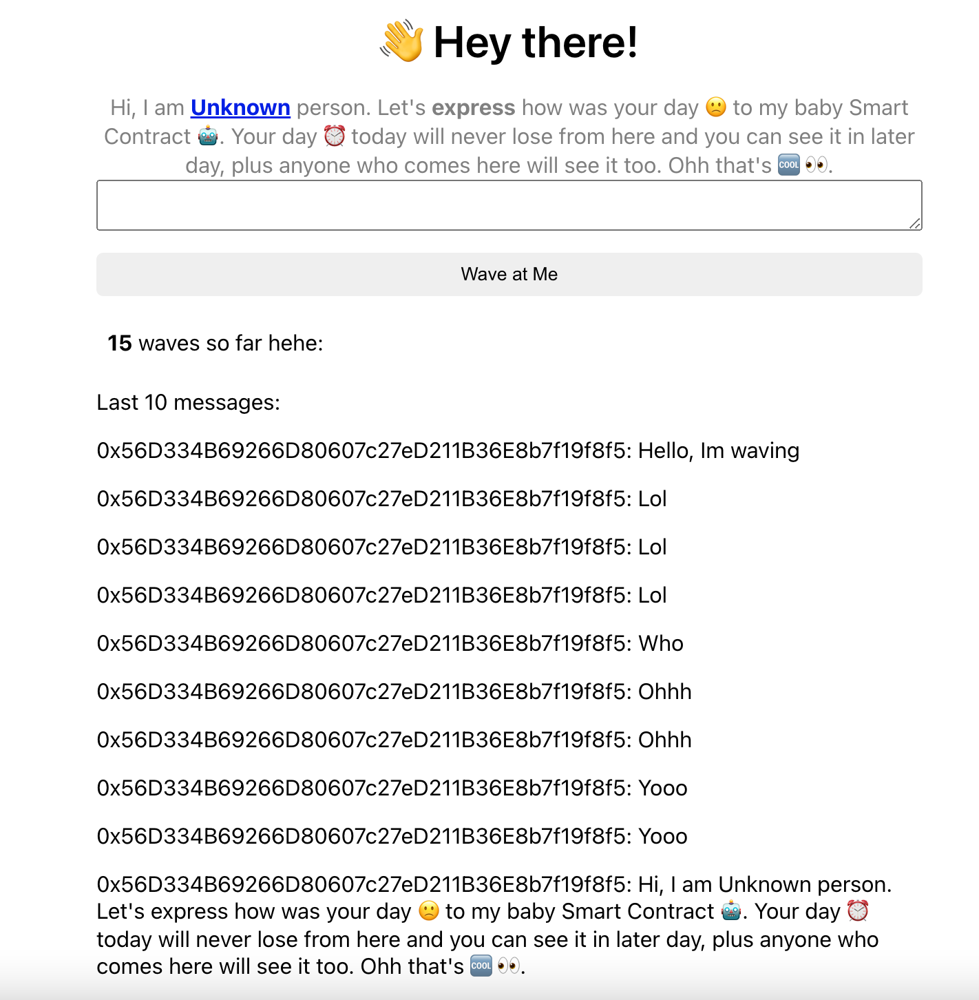

# Building Smart Contract for Beginner
`Note: this project is implemented from a Web3 tutorial on buildspace.so.`

# What does it do?
In this project, we are going to build a simple __Smart Contract__ which is called 
**Wave at Me**. It allows anyone who comes to wave and drop whatever messages to others will see. The messages will be stored in a Testnet, a public blockchain network (Rinkeby Testnet). 

# Development Tools
- NodeJs + Solidity
- Hardhat (local network)
- Wallet (prefered Metamask)
- [Alchemy ](https://www.alchemy.com/) (to bridge smart contract deployment to public network)


# Deployment
- Instasll node's packages
  
  `npm install`
- Configurations
  
    `hardhat.config.js`
    ```
    STAGING_ALCHEMY_KEY= //Alchemy app's key
    PROD_ALCHEMY_KEY= [needed in prodcution]
    PRIVATE_KEY= // Wallet's private key
    ```
- Compiling Smart Contract
  
  `npx hardhat run script/run.js`
- Deploy
  
  your have two option to deploy smart contract whether local or publick network.

   - `Local Network`
  ```
    npx hardhat run scripts/deploy.js --network localhost
  ```
  - `Public Network`
  ```
    npx hardhat run scripts/deploy.js --network rinkeby  
  ```
All above things are about building Smart Contract. So, how about connecting to deployed `Smart Contract` on a public Testnet (RinkeBy)

I had built a front-end DApp on `Replit` that allow people to interact with our smart contract. [Code](https://github.com/borinmin/wave-portal-client)

Let's wave to see what happend [Link](https://wave-at-me.minborin.repl.co/)


